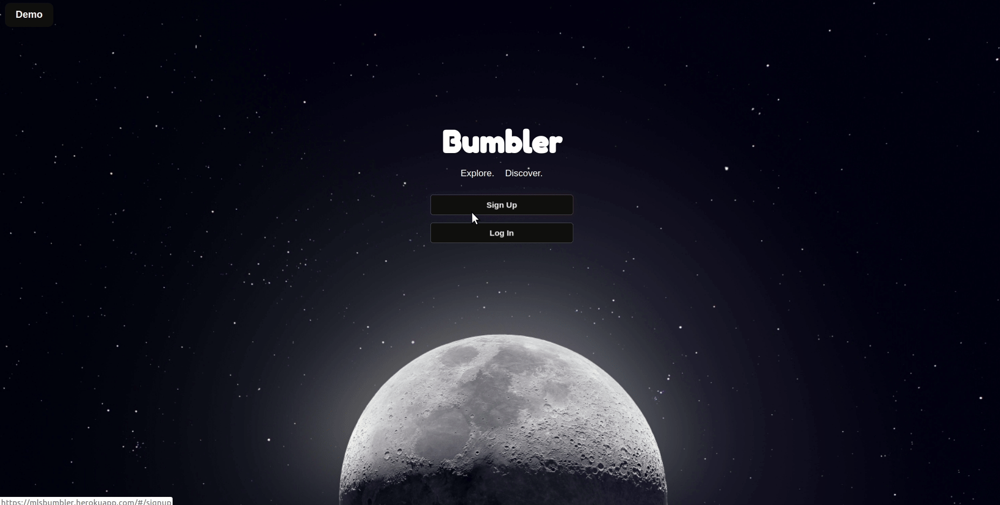
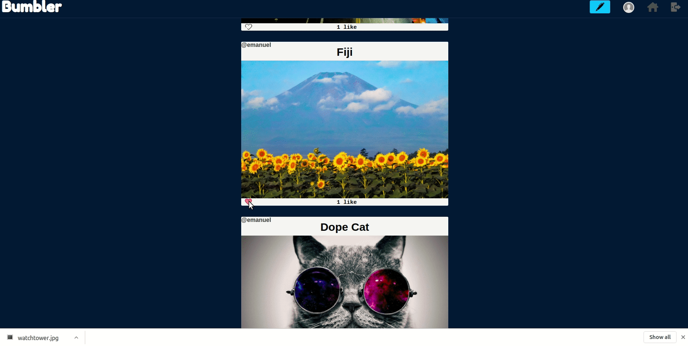

### [Bumbler](https://mlsbumbler.herokuapp.com)

Welcome to Bumbler. This is my clone of Tumblr which I developed in under two weeks. Just like Tumlbr it has the ability to post pictures or text blogs which is what makes up most of the site. I made this single page app using Rubyfor my backend, ReactJS and Redux for the frontend and PostgreSQL for the database. Bumbler includes all the basic social media app functions.

### Demo Login

Besides Login and Signup on the greeting page there is the option for a Demo login feature which will automatically log you in to Bumbler without having to create a new user. *shown below*

### Feed

Upon login you are introduced to the first feature of the app. The Post Feed. This page shows all of the posts from different users of the app including the current user.

### Create Post

By clicking the blue create-post button the user can create a post of his choosing. The created post will then be added to the feed and can be updated or destroyed by the user if he so chooses.

### User blog page

By clicking the profile button on the top a user can navigate to their blog page which displays only their posts. While this page is unique to the current user, by clicking on the author name in top left of another user's post you can navigate to that user's blog page.

### Technologies

- Backend Languages
  * Ruby
  * ReactJS
  * Redux
- Frontend Languages
  * Javascript
  * HTML
  * CSS
- Database
  * PostgreSQL
